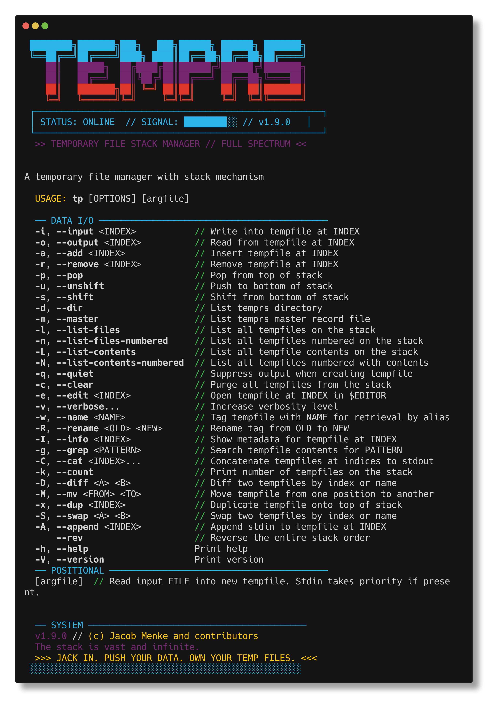
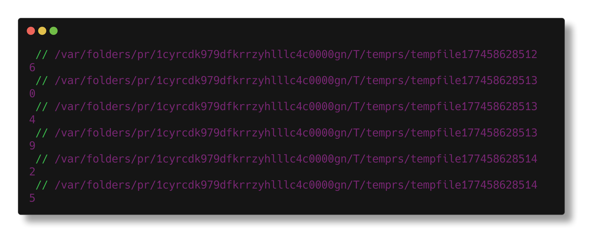
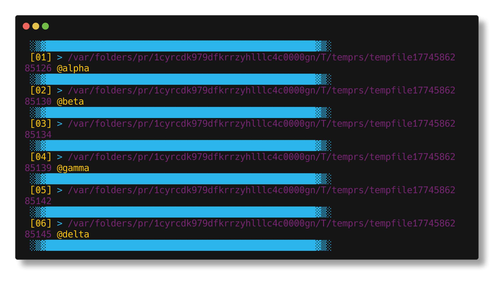
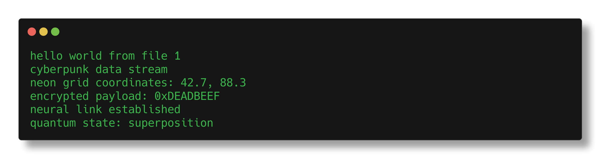
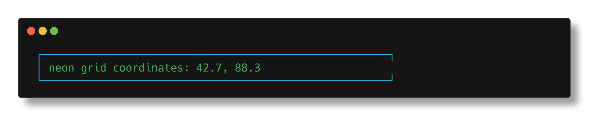

```
 ████████╗███████╗███╗   ███╗██████╗ ██████╗ ███████╗
 ╚══██╔══╝██╔════╝████╗ ████║██╔══██╗██╔══██╗██╔════╝
    ██║   █████╗  ██╔████╔██║██████╔╝██████╔╝███████╗
    ██║   ██╔══╝  ██║╚██╔╝██║██╔═══╝ ██╔══██╗╚════██║
    ██║   ███████╗██║ ╚═╝ ██║██║     ██║  ██║███████║
    ╚═╝   ╚══════╝╚═╝     ╚═╝╚═╝     ╚═╝  ╚═╝╚══════╝
```

[](https://crates.io/crates/temprs)
[](https://crates.io/crates/temprs)
[](https://docs.rs/temprs)
[](https://opensource.org/licenses/MIT)
[](https://github.com/MenkeTechnologies/temprs/actions)

### `[TEMPORARY FILE STACK MANAGER // FULL SPECTRUM DATA CONTROL]`

 ┌──────────────────────────────────────────────────────────────┐
 │ STATUS: ONLINE &nbsp;&nbsp; THREAT LEVEL: NEON &nbsp;&nbsp; SIGNAL: ████████░░ │
 └──────────────────────────────────────────────────────────────┘

> *"The stack is vast and infinite."*

---

## [0x00] SCREENSHOTS

#### HELP // SYSTEM INTERFACE


#### LIST FILES // STACK ENUMERATION


#### LIST NUMBERED // INDEXED STACK VIEW


#### LIST CONTENTS // FULL DATA DUMP


#### OUTPUT // DATA EXTRACTION


---

## [0x01] SYSTEM REQUIREMENTS

- Rust toolchain // `rustc` + `cargo`

## [0x02] INSTALLATION

#### DOWNLOADING PAYLOAD FROM CRATES.IO

```sh
cargo install temprs
```

#### COMPILING FROM SOURCE

```sh
git clone https://github.com/MenkeTechnologies/temprs
cd temprs
cargo build --release
```

[temprs on Crates.io](https://crates.io/crates/temprs)

#### ZSH COMPLETION // TAB-COMPLETE ALL THE THINGS

```sh
# copy to a directory in your fpath
cp completions/_tp /usr/local/share/zsh/site-functions/_tp

# or add the completions directory to fpath in your .zshrc
fpath=(/path/to/temprs/completions $fpath)

# then reload completions
autoload -Uz compinit && compinit
```

Completions dynamically resolve stack indices, file names, and `@name` tags.

---

## [0x03] USAGE

> Replace `CMD` with any command, `FILE` with any file, `INDEX` with any index

#### SCANNING DATA STREAMS // STDIN OPERATIONS

```sh
# jack data into a new tempfile on top of stack
CMD | tp

# jack data in and echo contents to stdout
CMD | tp -v

# read from top of stack to stdout
tp | CMD
```

#### TARGETING INDEXED TEMPFILES // PRECISION I/O

```sh
# write stdin into tempfile at index 1
CMD | tp -i 1

# write stdin into tempfile at index 1 and echo to stdout
CMD | tp -i 1 -v

# output tempfile at index 1 to stdout
tp -o 1 | CMD
```

#### LOADING FILE PAYLOADS // FILE OPERATIONS

```sh
# read FILE into new tempfile on top of stack
tp FILE | CMD

# read FILE into new tempfile and write contents to stdout
tp -v FILE | CMD

# write FILE contents to tempfile 1
tp -i 1 FILE | CMD

# write FILE contents to tempfile 1 then to stdout
tp -vi 1 FILE | CMD
```

#### CHAINING DATA STREAMS // PIPELINE OPERATIONS

```sh
# read stdin to tempfile 1 then write to stdout
CMD | tp -vi 1 | CMD

# choose input tempfile and write to tempfile at index 2 and stdout
CMD | tp -vi 2
```

#### APPENDING DATA // ACCUMULATE

```sh
# append stdin to tempfile at INDEX
CMD | tp -A INDEX

# append by name
CMD | tp -A mydata
```

#### ENUMERATING STACK CONTENTS // LISTING

```sh
# list all tempfiles on the stack
tp -l

# list all tempfiles with contents
tp -L

# list all tempfiles numbered
tp -n

# list all tempfiles numbered with contents
tp -N

# print the number of files on the stack
tp -k
```

#### EDITOR INTEGRATION // DIRECT ACCESS

```sh
# open tempfile at INDEX in $EDITOR (falls back to vi)
tp -e INDEX

# open the most recent tempfile (top of stack)
tp -e -1
```

#### NAMING TEMPFILES // ALIAS TAGS

```sh
# tag a new tempfile with a name
CMD | tp -w mydata

# retrieve by name instead of index
tp -o mydata | CMD

# remove by name
tp -r mydata

# rename a tag
tp -R mydata newname

# rename by index
tp -R 1 newname
```

#### INSPECTING TEMPFILES // METADATA

```sh
# show metadata for tempfile by name or index
tp -I mydata
tp -I 1
```

#### SEARCHING CONTENTS // GREP

```sh
# search all tempfiles for a pattern
tp -g PATTERN

# exits 0 if matches found, 1 if none
tp -g needle && echo "found"
```

#### CONCATENATING TEMPFILES // MERGE

```sh
# concatenate tempfiles by index
tp -C 1 2 3 | CMD

# concatenate by name
tp -C alpha beta | CMD

# mix indices and names, any order
tp -C 3 alpha 1
```

#### COMPARING TEMPFILES // DIFF

```sh
# unified diff of two tempfiles by index
tp -D 1 2

# diff by name
tp -D alpha beta

# exits 0 if identical, 1 if different
```

#### STACK MANIPULATION // PUSH / POP / SHIFT

```sh
# purge all tempfiles
tp -c

# remove tempfile at INDEX
tp -r INDEX

# insert tempfile at INDEX
CMD | tp -a INDEX

# insert FILE at INDEX
tp -a INDEX FILE

# pop from top of stack
tp -p

# push to bottom of stack
CMD | tp -u

# push to bottom of stack (equivalent)
CMD | tp -a 1

# shift from bottom of stack
tp -s

# move tempfile from one position to another
tp -M 1 3

# move by name
tp -M mydata 1

# duplicate tempfile onto top of stack
tp -x INDEX
tp -x mydata

# swap two tempfiles
tp -S 1 3
tp -S alpha beta

# reverse the entire stack
tp --rev
```

---

## [0x04] ENVIRONMENT

```sh
# override the default temp directory (default: $TMPDIR/temprs)
export TEMPRS_DIR=/path/to/custom/dir
```

---

## [0x05] STACK ARCHITECTURE

```
 ┌─────────────────────────────────────┐
 │  INDEX N   ▓▓  TOP OF STACK (newest)│
 │  INDEX N-1 ▓▓  ...                  │
 │  INDEX 2   ▓▓  ...                  │
 │  INDEX 1   ▓▓  BOTTOM OF STACK      │
 └─────────────────────────────────────┘
```

- Tempfiles are numbered in ascending order // highest index = top of stack
- Negative indices are valid at any `INDEX` position // range: `-stack_size .. -1`
- Positive indices range from `1 .. stack_size`
- Index `0` is always **invalid**
- Both `tp` and `temprs` binaries are installed

---

## [0xFF] LICENSE

 ┌──────────────────────────────────────────────────────────┐
 │ MIT LICENSE // UNAUTHORIZED REPRODUCTION WILL BE MET     │
 │ WITH FULL ICE                                            │
 └──────────────────────────────────────────────────────────┘

---

```
░░░░░░░░░░░░░░░░░░░░░░░░░░░░░░░░░░░░░░░░░░░░░░░░░░░░░░░░░░░
░░ >>> JACK IN. PUSH YOUR DATA. OWN YOUR TEMP FILES. <<<   ░░
░░░░░░░░░░░░░░░░░░░░░░░░░░░░░░░░░░░░░░░░░░░░░░░░░░░░░░░░░░░
```

##### created by [MenkeTechnologies](https://github.com/MenkeTechnologies)
